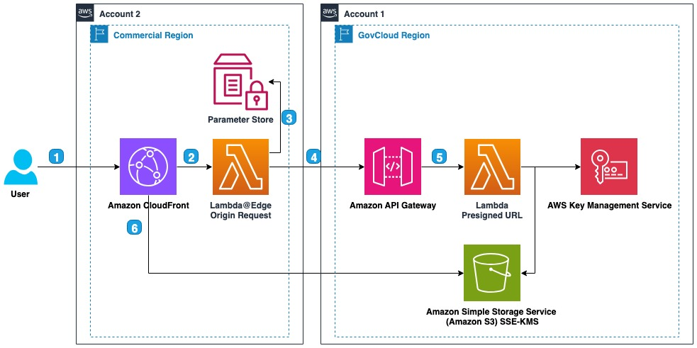

# Using Amazon CloudFront to Distribute GovCloud Amazon S3 (SSE-KMS) public files

This solutions is to enable domain name file access to a [Amazon Simple Storage Service (Amazon S3)](https://aws.amazon.com/s3/) bucket with [SSE-KMS encryption](https://docs.aws.amazon.com/AmazonS3/latest/userguide/UsingKMSEncryption.html) located in a [GovCloud](https://aws.amazon.com/govcloud-us) region. In a standard [commercial region] (https://aws.amazon.com/about-aws/global-infrastructure/regions_az/) implementation [Amazon CloudFront](https://aws.amazon.com/cloudfront) would be setup to use [Origin Access Control (OAC)](https://docs.aws.amazon.com/AmazonCloudFront/latest/DeveloperGuide/private-content-restricting-access-to-s3.html). OAC is not availabe from a commercial region to a GovCloud region. Access to the GovCloud S3 bucket can be granted via presigned URLs, using CloudFront in the commercial region to enable the use of a domain name and the other benefits of CloudFront.

## Architecture

1. The user will request a file using a standard domain URL hosted by Amazon CloudFront in Account 2 which is a commerical region.
2. Amazon CloudFront will direct the request to the [Lambda@Edge](https://docs.aws.amazon.com/AmazonCloudFront/latest/DeveloperGuide/lambda-at-the-edge.html) origin request function.
3. The Lambda@Edge function will retrieve the current GovCloud API Gateway endpoint from the AWS Systems Manager Parameter Store. 
4. If the URL does not contain a 'X-Amz-Credential' parameter then the function will request a presigned URL from Account 1's [Amazon API Gateway](https://aws.amazon.com/api-gateway/) hosted in a GovCloud region.
5. The Amazon API Gateway calls an [AWS Lambda](https://aws.amazon.com/pm/lambda) function to create a presigned URL of the Amazon S3 bucket which is SSE-KMS encrypted.
6. The Lambda@Edge function rewrites the initial URL to include the presigned URL query parameters and finally returns a 302 redirect allowing the end user to view the file located in the GovCloud region S3 bucket of Account 1.

## Requirements
1. <a href="https://aws.amazon.com/cdk/">AWS Cloud Development Kit</a> (CDK) 2.151.0 or higher
2. [AWS CLI](https://aws.amazon.com/cli/) for testing commands

## Setup
1. Git clone this repository

### Setup Account 1 (GovCloud)
1. From the <b>root</b> folder change directories into the <b>account1-govcloud</b> folder.
2. Make sure to setup your AWS credentials to align with your GovCloud account
3. Run `npm ci` to install all packages required
4. Run `cdk deploy` to deploy
5. Note the outputs `PresignedUrlApiUrl`, `BucketName`, and `BucketRegion` which will be used as inputs for Account 2 setup

### Setup Account 2 (Commercial)
1. From the <b>root</b> folder change directories into the <b>account2-cloudfront</b> folder.
2. Make sure to setup your AWS credentials to align with your commercial CloudFront account
3. Run `npm ci` to install all packages required
4. Setup the required environment variables:
   * `CDK_PRESIGNED_URL` set this value to the output `PresignedUrlApiUrl` given from the Account 1 setup
   * `CDK_S3_BUCKET_NAME` set this value to the output `BucketName` given from the Account 1 setup
   * `CDK_S3_BUCKET_REGION` set this value to the output `BucketRegion` given from the Account 1 setup
4. Run `cdk deploy` to deploy
5. Note the output `DemoRedirectUrl` which is the demo URL to validate the system is working.
6. Continue testing by placing files in the GovCloud S3 bucket and validating you can access those files from the CloudFront distribution.

## Running
1. Use the `DemoRedirectUrl` and enter it into your browswer of choice.
2. Validate the URL is redirected and the presigned URL query parameters are added.
3. Validate the `Hello World` web page is visible.

## Useful commands

* `npm run build`   compile typescript to js
* `npm run watch`   watch for changes and compile
* `npm run test`    perform the jest unit tests
* `npx cdk deploy`  deploy this stack to your default AWS account/region
* `npx cdk diff`    compare deployed stack with current state
* `npx cdk synth`   emits the synthesized CloudFormation template

## Resource Cleanup

### Cleanup Account 1 (GovCloud)
1. From the <b>root</b> folder change directories into the <b>account1-govcloud</b> folder.
2. Make sure to setup your AWS credentials to align with your GovCloud account
3. Run <b>`cdk destroy`</b>

### Cleanup Account 2 (Commercial)
1. From the <b>root</b> folder change directories into the <b>account2-cloudfront</b> folder.
2. Make sure to setup your AWS credentials to align with your commercial CloudFront account
3. Run <b>`cdk destroy`</b>
   - NOTE: if you get an error from CloudFormation deleting the Lambda@Edge function, then you should wait a while and then retry cdk destroy. [Reference documentation](https://docs.aws.amazon.com/AmazonCloudFront/latest/DeveloperGuide/lambda-edge-delete-replicas.html).

## Security

See [CONTRIBUTING](CONTRIBUTING.md#security-issue-notifications) for more information.

## License

This library is licensed under the MIT-0 License. See the LICENSE file.

