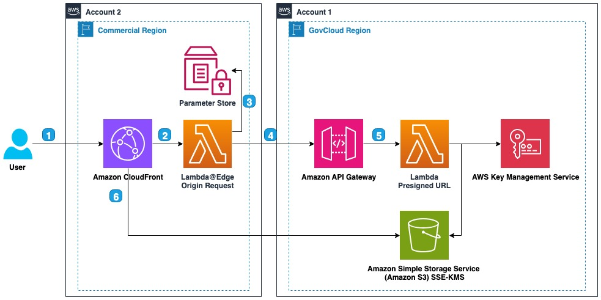

# Using Amazon CloudFront to Distribute GovCloud Amazon S3 (SSE-KMS) Files

This solution enables domain-based file access to an [Amazon S3](https://aws.amazon.com/s3/) bucket with [SSE-KMS encryption](https://docs.aws.amazon.com/AmazonS3/latest/userguide/UsingKMSEncryption.html) located in an [AWS GovCloud](https://aws.amazon.com/govcloud-us) region through [Amazon CloudFront](https://aws.amazon.com/cloudfront).

## Problem Statement

In standard commercial regions, CloudFront uses [Origin Access Control (OAC)](https://docs.aws.amazon.com/AmazonCloudFront/latest/DeveloperGuide/private-content-restricting-access-to-s3.html) to securely access S3 buckets. However, OAC is not available for cross-partition access from commercial regions to GovCloud regions. This solution bridges that gap using presigned URLs and Lambda@Edge for seamless, secure access.

## Solution Overview

The solution uses a two-account architecture:
- **Account 1 (GovCloud)**: Hosts the SSE-KMS encrypted S3 bucket and presigned URL generation API
- **Account 2 (Commercial)**: Hosts CloudFront distribution with Lambda@Edge for intelligent URL redirection

## Architecture


### Request Flow

1. **Initial Request**: User requests a file using a CloudFront domain URL (Account 2 - Commercial region)
2. **Lambda@Edge Trigger**: CloudFront triggers the [Lambda@Edge](https://docs.aws.amazon.com/AmazonCloudFront/latest/DeveloperGuide/lambda-at-the-edge.html) origin request function (`edge_redirect.py`)
3. **Presigned URL Check**: Lambda@Edge checks if the request already contains presigned URL parameters (`X-Amz-Credential`)
4. **Parameter Store Lookup**: If not presigned, retrieves the GovCloud API Gateway endpoint from AWS Systems Manager Parameter Store
5. **Presigned URL Generation**: Calls Account 1's [API Gateway](https://aws.amazon.com/api-gateway/) in GovCloud region to generate presigned URL
6. **Lambda Processing**: API Gateway invokes Lambda function (`presigned.py`) to create presigned URL for SSE-KMS encrypted S3 object
7. **302 Redirect**: Lambda@Edge returns HTTP 302 redirect with presigned URL, allowing secure access to GovCloud S3 content

### Key Components

#### Account 1 (GovCloud)
- **S3 Bucket**: SSE-KMS encrypted storage for files
- **Lambda Function** (`presigned.py`): Generates presigned URLs for S3 objects
- **API Gateway**: REST endpoint for presigned URL requests
- **IAM Roles**: Permissions for Lambda to access S3 and KMS

#### Account 2 (Commercial)
- **CloudFront Distribution**: CDN with custom domain support
- **Lambda@Edge Function** (`edge_redirect.py`): Intelligent request routing and URL transformation
- **Systems Manager Parameter Store**: Stores GovCloud API Gateway endpoint
- **IAM Roles**: Permissions for Lambda@Edge execution

## Lambda@Edge Redirect Functionality

The `edge_redirect.py` function implements intelligent request routing with the following logic:

### Core Functions

#### `get_api_gateway_url_from_parameter_store()`
- Retrieves the GovCloud API Gateway endpoint from Systems Manager Parameter Store
- Parameter name: `cloudfront_api_gateway_presigned_url`
- Enables dynamic configuration without code changes

#### `call_api_gateway(api_gateway_url, params)`
- Makes HTTP GET request to GovCloud API Gateway
- Passes the requested URI as a parameter
- Returns the generated presigned URL from the response
- Uses urllib3 for reliable HTTP communication

#### `lambda_handler(event, context)`
Main processing logic:
1. **Request Analysis**: Extracts URI and query string from CloudFront event
2. **Presigned URL Detection**: Checks for existing `X-Amz-Credential` parameter
3. **Conditional Processing**:
   - If already presigned: Returns request unchanged (pass-through)
   - If not presigned: Generates new presigned URL and creates 302 redirect
4. **Response Generation**: Creates HTTP 302 redirect response with presigned URL

### Security Features
- **Parameter Validation**: Validates incoming requests before processing
- **Error Handling**: Comprehensive exception handling with proper logging
- **Presigned URL Expiration**: URLs expire after 1 hour for security
- **SSE-KMS Support**: Maintains encryption in transit and at rest

### Performance Optimizations
- **Caching Logic**: Avoids regenerating presigned URLs for already-signed requests
- **Minimal Processing**: Direct pass-through for presigned requests
- **Efficient Parsing**: Optimized URL and query string processing

## Requirements
1. [AWS Cloud Development Kit (CDK)](https://aws.amazon.com/cdk/) 2.151.0 or higher
2. [AWS CLI](https://aws.amazon.com/cli/) for testing and validation
3. Two AWS accounts:
   - GovCloud account with S3 and Lambda permissions
   - Commercial account with CloudFront and Lambda@Edge permissions
4. Node.js 18.x or higher for CDK deployment
5. Python 3.9+ runtime for Lambda functions

## Prerequisites
- AWS credentials configured for both accounts
- Appropriate IAM permissions for CDK deployment
- Understanding of cross-account AWS resource access patterns

## Setup

### Step 1: Clone Repository
```bash
git clone <repository-url>
cd cloudfront-to-govcloud-s3-sse-kms
```

### Step 2: Deploy Account 1 (GovCloud)

1. **Navigate to GovCloud directory:**
   ```bash
   cd account1-govcloud
   ```

2. **Configure AWS credentials for GovCloud account:**
   ```bash
   aws configure --profile govcloud
   # OR set environment variables
   export AWS_PROFILE=govcloud
   ```

3. **Install dependencies and deploy:**
   ```bash
   npm ci
   cdk bootstrap  # First time only
   cdk deploy
   ```

4. **Save deployment outputs:**
   Note these critical outputs for Account 2 setup:
   - `PresignedUrlApiUrl`: API Gateway endpoint for presigned URL generation
   - `BucketName`: S3 bucket name for file storage
   - `BucketRegion`: AWS region where the bucket is located

### Step 3: Deploy Account 2 (Commercial)

1. **Navigate to CloudFront directory:**
   ```bash
   cd ../account2-cloudfront
   ```

2. **Configure AWS credentials for commercial account:**
   ```bash
   aws configure --profile commercial
   # OR set environment variables
   export AWS_PROFILE=commercial
   ```

3. **Set required environment variables:**
   ```bash
   export CDK_PRESIGNED_URL="<PresignedUrlApiUrl from Account 1>"
   export CDK_S3_BUCKET_NAME="<BucketName from Account 1>"
   export CDK_S3_BUCKET_REGION="<BucketRegion from Account 1>"
   ```

4. **Install dependencies and deploy:**
   ```bash
   npm ci
   cdk bootstrap  # First time only
   cdk deploy
   ```

5. **Save deployment outputs:**
   - `DemoRedirectUrl`: Test URL to validate the complete system

## Testing the Solution

### Step 1: Basic Functionality Test
1. **Use the demo URL:**
   ```bash
   # Open in browser or use curl
   curl -I "<DemoRedirectUrl from Account 2 deployment>"
   ```

2. **Verify redirect behavior:**
   - Initial request should return HTTP 302 redirect
   - Location header should contain presigned URL with `X-Amz-Credential` parameter
   - Following the redirect should display the "Hello World" content

### Step 2: Upload and Test Custom Files
1. **Upload files to GovCloud S3 bucket:**
   ```bash
   aws s3 cp myfile.txt s3://<BucketName>/myfile.txt --profile govcloud
   ```

2. **Access via CloudFront:**
   ```bash
   # Replace <CloudFrontDomain> with your distribution domain
   curl "https://<CloudFrontDomain>/myfile.txt"
   ```

### Step 3: Validate Security
- Verify files are encrypted with SSE-KMS in S3
- Confirm presigned URLs expire after 1 hour
- Test that direct S3 access is blocked without presigned URLs

## Troubleshooting

### Common Issues

1. **Lambda@Edge deployment errors:**
   - Ensure Lambda@Edge functions are deployed to us-east-1
   - Wait for CloudFront distribution propagation (15-20 minutes)

2. **Cross-account access issues:**
   - Verify IAM roles have correct permissions
   - Check API Gateway endpoint accessibility from commercial region

3. **Presigned URL generation failures:**
   - Confirm S3 bucket permissions for Lambda execution role
   - Verify KMS key permissions for encryption/decryption

### Debug Steps
1. Check CloudWatch logs for Lambda@Edge function
2. Verify Systems Manager Parameter Store contains correct API Gateway URL
3. Test API Gateway endpoint directly from commercial region


## Useful commands

* `npm run build`   compile typescript to js
* `npm run watch`   watch for changes and compile
* `npm run test`    perform the jest unit tests
* `npx cdk deploy`  deploy this stack to your default AWS account/region
* `npx cdk diff`    compare deployed stack with current state
* `npx cdk synth`   emits the synthesized CloudFormation template

## Resource Cleanup

⚠️ **Important**: Clean up resources in reverse order to avoid dependency issues.

### Step 1: Cleanup Account 2 (Commercial)
```bash
cd account2-cloudfront
aws configure --profile commercial  # or export AWS_PROFILE=commercial
cdk destroy
```

**Note**: If CloudFormation fails to delete the Lambda@Edge function, wait 15-30 minutes and retry. Lambda@Edge replicas need time to be removed from all edge locations. See [AWS documentation](https://docs.aws.amazon.com/AmazonCloudFront/latest/DeveloperGuide/lambda-edge-delete-replicas.html) for details.

### Step 2: Cleanup Account 1 (GovCloud)
```bash
cd ../account1-govcloud
aws configure --profile govcloud  # or export AWS_PROFILE=govcloud
cdk destroy
```

### Step 3: Verify Cleanup
- Check CloudFormation stacks are deleted in both accounts
- Verify S3 bucket is empty and deleted (if configured for deletion)
- Confirm no orphaned Lambda@Edge functions remain

## Security

See [CONTRIBUTING](CONTRIBUTING.md#security-issue-notifications) for more information.

## License

This library is licensed under the MIT-0 License. See the LICENSE file.

